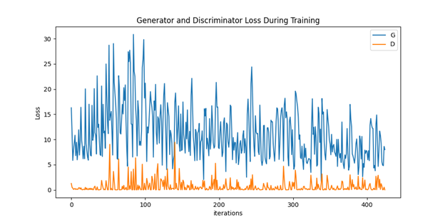
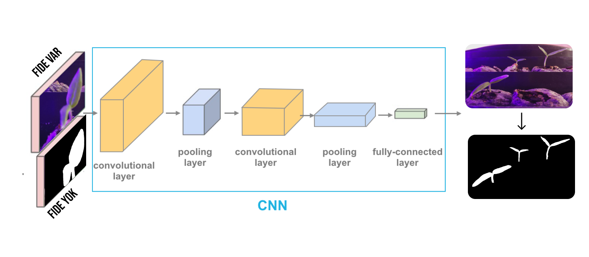
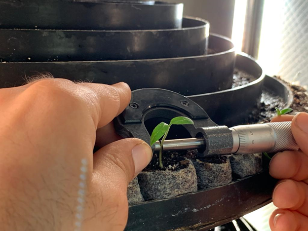

*HAZIRLIK ve DONANIMSAL REVİZYON*

Yeni versiyon sistemimimizde fide yetiştirme bantlarının katman
sayısının birden fazla olması görüntü analizini etkileyecek boyutta bir
fark yaratıyordu. Eski görüntülerde kamera açısı yetiştirme bantlarının
bir katına ait çift katmanı kapsayacak şekilde sabitlenmişti. Fide
yetiştirme bantlarının katman sayısı arttırıldı. Daha önce 5 raflı
sistem kullanılırken şimdi 6 raflı sistem kullanılmaktadır. Analizde baz
resimlerimizin alt kısımlarındaki tohumu besleyen fide yetiştirme
slablarinin boyutlarını analiz ortamına etkisinden ve daha düşük hacimli
olmasına rağmen çıktı potansiyeli olarak herhangi bir handikap
oluşturmamasından dolayı küçültüldü. Bu sayede daha fazla üretim
sağlandı.

Bitkiyi besleyen ışık sayısı azaltıldı. Sarı ışık FARMER bitki
yetiştirme ortamından soyutlandı. Dönme hızı dakikada 3-5 devirken, genç
fide evresi için bu süreç 5-6 devir/dakikaya çıkarıldı.

Yeni sistemde bu süreci kameranın konumlandırma pozisyonunu değiştirerek
aşılmaya çalışıldı, ama bu süreçte FARMER makinasının iç dizayn
kısmındaki duvar ile bitki yetiştirme bantları arasındaki uzaklık konum
değişikliği bakımından bize çok fazla opsiyon vermemektedir.

Kamera bağlantısı, kullanıcının yüzü makineye bakacak şekilde kabul
edilirse, sağ taraftan makine içine ulaştırılıyordu ve sağ taraftaki
ışıkları kullanmak istediğimizde(beyaz ve mavi), beyaz ışığın görüntüyü
iyileştirdiği fark edildi. Beyaz ışık diğer ışık türlerine göre görüntü
analizi histogram eşik boyutunun dengeli şekilde aktarılmasına engel
olmuyordu. Bu yüzden beyaz ışığı kamera arkasına alacak şekilde 30
derecelik sola doğru bir açısal konumlandırma ile yine çift katman
görüntüye denklenecek şekilde görüntü alma ortamı oluşturuldu.

Kısıtlı uzaklık görüntülerde yetiştirme sehpasına ait iki katın aynı
görüntüde çıkmasını sağlıyordu. Üst kattaki bitkilerin gövdeden yukarıya
doğru olan kısımlarında yaprak çıkmaya varmadan görüntüler kesiliyordu
ve ikinci kattan sonraki kısımlar yani kadraja sığmıyordu. Bu yüzden
analiz yapamayacak boyutta bir görüntü oluştuğu için ikinci kattan
sonraki bitkiler için bitkileri test ortamından soyutlama stratejisi
güdüldü. Bunun sebebi kamera açısal konumlandırma opsiyonlarının az
olmasıydı.

Yaprakların daha kolay tespit edilebilmesi ve ard arda gelen
görüntülerin daha iyi ayrıştırılabilmesi için görüntüler arasında bir
fide olacak şekilde boşluklar bıraktık. Bu sayede oluşabilecek dijital
hesaplama hatalarının önüne geçmeyi başardık.

Fotoğraf boyutları konusunda önceden 4:3 en boy oranına sahip 1640x1232
resimler kullanılırken, yeni oryantasyonda 16:9 en boy oranına sahip
1280x768 çözünürlükte resimler kullanmaktadır.

Bu sayede kaydedilen ve işlenen datanın çözünürlüklerinde yüksek oranda
düşüş sağladık. Bu geliştirme hem analiz edebilme süresini etkileyerek
analiz üzerinden sonuç alma süresini kısalttı(piksel bazlı tespit ve
ayrıştırma yaptığımız için) hem de big data veri analizi ve veri seti
oluşturma süreçleri için resimlerin analiz edilebilme özelliklerinden
ödün vermeden alan kazanmamazı sağladı.

*SINIFLANDIRMA*

Bitki büyüme evreleri Çimlenme, Genç Fide, Yetişkin Fide olmak üzere üç
evreli gelişim süreci ile kullanıma uygun hâle gelmektedir.

Bu yüzden Çimlenme ile Genç Fide'yi ayıracak bir sınıflandırma sistemi
oluşturuldu. Sınıflandırma sistemi fide çıkmayan çimlenme evresindeki
resimlerle fidenin yaprak kısımlarının kompleksleşmediği kadelyon bitki
evresini temsil eden genç fide görüntülerini ayırmaktadır.

Bu ayrımı sağlayabilmek için görüntüler çoğaltıldı(yani augment edildi).
Bunu süreçte, ham veri haznesi hazırlanırken sadece yatay eksende
döndürme kullanıldı. Dikey eksende döndürme ham veri kümesinde
kullanılmadı, çünkü çekilen fotoğraflar hep aynı açıdan veri üretmek
üzere tasarlanmıştı.

Veri kümesini sanal boyutta arttıran yatay eksende döndürme ve küçük
parçalar alan crop işlemi var olan imge işleminin ön işleme kısmında
kullanıldı. Predefined model kullanıldığı için 224x224'lük boyutlarda
rastgele kesimler yapılmaktadır.

Şekil B: Transform Filtreleri

Normalizasyon kullanıldı, çünkü resimler arasında tonlama farklılıkları
oluşmaktadır. Batch size olarak veri haznemiz küçük olduğundan 64
kullandık. Bu sayede model daha az gürültü öğrenecek, bununla birlikte
aynı anda bütün veriyi işleyebilecek kapasite veri işlemi yaptığı için
optimizasyon işleminde büyük adımlarla ilerleme olacaktır. Batch size
belirlenirken toplam dataset'e bölünecek şekilde seçilmesi gerekiyor.

Düşük batch size denemesi yapıldığında(2 ve 4 \-- gpu/ram kullanımını
düşürmek için) kötü sonuçlar alındı. Bu sebebin arkasında local
optimum'a takılıp global optimuma hiç ulaşmaması yatmaktadır.
Gürültüleri öğrenme kapasitesi artmaktadır. Bu sonuçları
karşılaştırabilmek adına farklı formasyonlar kullanıldı.

Train data: 170 adet Test data: 20 adet. Pretrained model : densenet21
(ImageNet resimleriyle pretrain edilmiş) Feature'lar sabit bırakıldı ama
classfier modeli freeze edilip, modifiye edildi.

Şekil C: Model Yapısı

Şekil D: 300 Epoch 64 Batch Size'daki Çıktı Görüntüsü

Veri kümesi eleman sayısı az olduğu 100 epoch'tan sonra gelişim
göstermiyor. Resimleri artık kaydedebileceğimiz için artırılmış dataset
ile daha iyi sonuçlar almak için denemeler yapıldı. Elde edilen
görüntüler fide mi değil mi şeklinde ayırt eden bir yapay zeka modeli
eğitildi.

300 epoch(döngüde %0.2 test kaybıyla %85-90 doğrulukta çalışmaktadır).

Modelin eğitimi ve tahmin süreçlerinde kütüphane seçimi olarak Pytorch
kullanıldı. Elde edilen pth. dosyalarının C++ ortamında(IDE olarak
Visual Studio) çalıştırılabilmesi için Libtorch denilen Pytorch C++
API'si kullanıldı.

Özellikle üretim aşamasında düşük gecikme süreli/yakın gerçek zamanlı
modeller kullanmak istediğinizde karşınıza bir kaç sorun çıkmaktadır.
Karşılaşılan en kritik sorunların başında Python'da yaşanan hız/gecikme
sorunları ve çoklu işlem/iş parçacığı kullanımı kaynaklı sorunların
geldiğini düşünülmektedir. Bu noktada C++ gibi bir dilin getireceği bazı
kolaylıklar kullanılmak istenildi.

Mevcut .pth çıktılarından C++ dilinin kullanıldığı ortamda kullanılmak
üzere trace dosyaları(.pt) oluşturuldu. Bu dosyalar fonksiyonlar
içerisinde çağrılarak mekanizmaya enjekte edildi.

Pytorch 1.9.0 Stabil sürüm kullanılmaktadır, arayüz işletimcisi olarak
paket yönetimlerini ve sanal ortamlarda ayrı ayrı çalışmamızı sağlayacak
Conda Cuda 10.2 destekli Pytorch ve libtorch kütüp kütüphanesini
kullanılmaktadır.

İlk olarak, görüntü işleme algoritmalarımızda Java diliyle yazılmış
ImageJ kütüphanesini kullandık. ImageJ kütüphanesi ya da ImageJ
kütüphanesi desteği kullanan Fiji uygulaması, karşılaştığımız birçok
problemde özgür bir çözüm ortamı sağlıyordu.

En başta, proje yönetimi konusunda problemler yaşadığımız için, projenin
kapsamlı olarak hangi noktada bitmesi gerektiğini bilmiyorduk. Bu yüzden
kullanmayı düşündüğümüz, ihtiyacımız olan birçok fonksiyonun neler
olması gerektiği konusunda eksikliklerimiz vardı. Java dilinde yazılmış
ImageJ kütüphanesinin ileride karşılaşabileceğimiz problemlere karşı iyi
bir dökümantasyona sahip olması bu konuda bizi daha cesaretli ve
vizyonlu kılıyordu. Kendine münhasır bir arayüz test ortamına da sahip
olması, Ar-Ge araştırmalarımızda bize kolaylık sağlamaktaydı.

İşlenmesi gereken baz ve ham resimleri ayıklayıp elde ettikten sonraki
süreçte iş akışının aktarılabilmesi adına yazılım geliştirme metotlarını
belirledik. Burada yazılım geliştirmek için görüntü işleme kısımları
için bize hız imkanı sunan OPENCV kütüphanesinden yaralanıldı.

OpenCV kütüphanesinden daha önceki çalışmamızda Python dili ile aktarım
yapılıyordu. Yalnız hem kütüphane fonksiyonlarının çeşitliliği hem de
daha hız kazanmak adına C++ dilini tercih edildi.

*En önemli başlıca sebepleri:*

C++\'ın en büyük avantajı performanstır. C++ verimli bir şekilde çalışır
ve Python ile karşılaştırıldığında hız daha yüksektir. C++, gömülü
sistemler de dahil olmak üzere hemen hemen her platform için uygundur,
Python ise yalnızca yüksek seviyeli dilleri destekleyen belirli
platformlarda kullanılabilir. Bu ayrıcalığı bizim için önemliydi, çünkü
ileride konfigüre edebilmek açısından modular bir alt yapı
oluşturuyordu.

Güçlü yazılan bir dil olan C++, dinamik olarak yazılan Python\'dan daha
tahmin edilebilir. Bu özellik aynı zamanda C++ performansını da artırır.
C++, İşletim sistemleri yazmak da dahil olmak üzere sistem programlama
için kullanılabilir. Dil donanıma daha yakın olduğu için düşük seviyeli
programlamayı öğrenmek için de C++ kullanabiliriz. Python ile böyle bir
başarı mümkün değildir.

Yazılım geliştirme ortamları olarak C++ çalışmaları için Visual Studio
2019 Community, Python geliştirme ortamı olarak da JetBrains Pycharm
kullandık.

Obje tespiti ve sınıflandırması için iki ayrı pytorch/libtorch
class'larına sahibiz.

İlk iş görevimiz çoklu veri haznemiz arasında içinde fide olmayan
resimleri ayıklamak ve daha sonra bu ayıklanmış görüntüleri kendi içinde
obje tespiti için kullanmaktır.

Daha sonra resim işleme algoritmasıyla ayıklanmış görüntülerdeki obje
tespitiyle elde edilmiş objeler üzerinden yaprak boyu, gövde uzunluğu ve
kalınlığı hesaplamaktır.

SANAL VERİ ÇOĞALTMA(Virtual Augmentation)

GAN(General Adverserial Network) kullanarak veri kümesi sınıf eleman
sayısı arttırmayı denedik. Yalnız elde ettiğimiz sonuçlar tatmin edici
olmadığı için bu işlemden faydalanım sağlayamadık.

Kullanılan veri hazinesi linkteki gibidir:

[[https://drive.google.com/drive/folders/1pV4ArDaveCG-GAHd3FVGYf6ePIReIXlN?usp=sharing]{.underline}](https://drive.google.com/drive/folders/1pV4ArDaveCG-GAHd3FVGYf6ePIReIXlN?usp=sharing)

Kullanılan sınıflandırmada veriler iki kategoriye ayrılmıştır. İçinde
fide örneği bulunanlar ve fide örneği bulunmayanlar şeklindedir.

> Fide Var(126.png) Fide Yok(161.png)

{width="4.208333333333333in"
height="3.163008530183727in"}

Şekil E: Sınıflandırma Eğitim Grafiği

Bu çözüm yolunda artık çoklu dosyalar tek seferde analiz
edilebilmektedir. Boost kütüphanesi kullanılarak işlem haci arttırıldı
ve try catch blog yapısı kullanarak seedling olmayan bir resim
geldiğinde kodun exception olarak resimde fide yok şeklinde döndürülüp,
bir sonraki resme geçmesi sağlanıldı.

{width="6.5in" height="3.4583333333333335in"}

Son olarak da verileri büyük veri olarak tutabilmek için rapidjson
formatında kaydetme ortamı oluşturuldu.

Çıktı örnekleri olarak:

C:\\Users\\HTG\_SOFTWARE\\Desktop\\mixed\\17.png\
probablity: 99.7782\
predicted\_label(seedling == 1 && no\_seedling == 0): 1\
The sample consists seedling(s)

C:\\Users\\HTG\_SOFTWARE\\Desktop\\mixed\\161.png\
probablity: 92.0719\
predicted\_label(seedling == 1 && no\_seedling == 0): 0\
Process Tile Exception: The sample not consist any seedling(s)\
Skipping file because there is bad argument for the analysis!

Burada hedeflediğimiz sonuç yapay zeka ile görüntü işlemeye girecek imge
analizi resimlerinde gövde kalınlığı, uzunluğu ve yaprak uzunluğuna
erişmek istediğimiz için gövde ve yaprak bulunmayan yani fide evresine
girmeyen tohumları bulunduran resimlerin analize girmesini engellemekti.

Bu sayede hem hız kazandık hem de veri sınıflandırmasıyla ileride olacak
projeler için ilk adımı atmış olduğumuz ortamı oluşturduk.

*BÖLÜTLEME*

Fide resimleri sınıflandırıldıktan sonra, içinde fide imgesi bulunduran
görüntüler bölütleme algoritmasına girdi olarak verilmektedir.

100 epoch 256x256 patch çıkartılarak Unet modeli eğitildi. Çok iyi
sonuçlar alıyorum eski datalarda. Bu model GeForce 1080 ekran kartı ile
yaklaşık 305 dakikada eğitildi.

Kullanılan veri haznesi linkten ulaşılabilmektedir:

https://drive.google.com/drive/folders/1eU6zXiBFQEKjBqOKnfMQxBvJ9i8qMiN8?usp=sharing

Eğer 256x256 kesme işlemi yapılmasaydı ve direk parçalara bölmeden
eğitilmek istenseydi, eğitim süresi yaklaşık bunun 12 katına çıkıyor ve
3 gün sürüyordu.

Şekil F: Unet Model Yapısı

U-Net mimarisini kullanarak bir derin öğrenme modeli oluşturuldu. Veri
haznesi eleman sayısı düşük olduğu için bu model seçildi. Bu mimari
bölümlere ayırmak için tasarlandı. U-Net\'te havuzlama operatörlerinin
bulunduğu ardışık katmanlara göre ağ yukarı örnekleme operatörleri
tarafından değiştirilir ve ağ mimarisi simetriktir, uzamsal çıkaran bir
kodlayıcıya sahiptir.

Kodlayıcı 2x2\'lik bir ortalama havuzlama boyutu uygulaması ardından,
iki 3x3 evrişim işleminin bir dizisini uygular. Filtre sayısı her
evrişim katmanında ikiye katlanır. Her konvolüsyondan sonra işlem
normalize eden toplu normalleştirme uygulamasında önceki bir aktivasyon
katmanının çıktısı, parti ortalaması ve parti standart sapmasına
bölünür. Bu dizi dört kez tekrarlanır. Öte yandan, kod çözücü benzer
şekilde iki 3x3 transpoze edilmiş bir dizi uygulamaktadır.

Evrişim işlemleri dört kez yapılmıştır. Her kodlayıcının çıkışı evrişim
katmanı çıktısı ile birleştirilmiştir. Ardışık olarak dekoder yukarı
örnekleme işlemi, aktarılan evrişim katmanları, Decoder, birleştirilmiş
özellikleri alarak imge özelliklerini yukarı örnekledir. Bu birleştirme
işlemleri sistemin mekansal bilgi elde etmesini sağladı.

{width="6.5in" height="2.3333333333333335in"}

Şekil G: Unet Model Eğitim Grafiği

**batch\_size = 4\
patch\_size = 256\
num\_epochs = 100**

Sonuç çıktıları:

{width="6.5in" height="2.59375in"}

A\) B) C) D)

> A\) Yapay Zeka öğrenirken vurguladığı alanlar (Stres noktaları)
>
> B\) Makinenin çıkardığı sonuç(Yapay Zeka projesinin görüntü analizi
> çıktısı)
>
> C\) Label edilen görsel(Elle çizip eğitime gönderdiğim veri)
>
> D\) Orjinal Resim

Görüldüğü üzere çoğu makine çıktısı gerçek çıktıya yakın.

Eğitim sürecini hızlandırmak ve düşük donanım imkanlarımızdan dolayı
mevcut resmi 256x256'lık karelere bölüp, analizi her bir karede(toplam
12 tane; 1280/768) analizi gerçekleştirmek için resmi gridlere bölme ve
bölünmüş resimi analiz sonrası tekrar birleştirme uygulaması yapıldı.

    

    

    

**OBJE TESPİTİ SONRASI GÖRÜNTÜ ANALİZİ(MORFOLOJİK ANALİZ)**

Şekil J: Obje Tespiti Sonrası Görüntü Analizi Akış Şeması

Şekil K: Ham Resim

Fotoğraf çekilirken ortam ışığı konumlandırması değiştirilemediği için
kamera pozisyonunda oynamalarla maksimum net görüntü alınma testleri
gerçekleştirildi.

Testler sonucunda FARMER makinesinin beyaz ışığı dört köşeli ortamda,
kullanıcının baktığı yönde sağ arkada köşede kaldığı için, beyaz ışık
kamera arkasında kalacak şekilde kamera konumlandırılması yapıldı.

Kamera oryantasyonu köşe bölgede kaldığı için, kalibre edilmek için 30
derecelik kullanıcı yönüne doğru açısal kalibrasyon yapıldı ve
görüntüler elde edildi.

Şekil L: Histogram Analizi ve Görüntü İşleme

Bu görüntülerden kullanılan ışık ortamı ve bitkilerin renk soğurma ve
yansıtma değerleri de göz önünde alınarak, histogram analizi
sonrası(Thresholding'e çıktı verirken daha optimal sonuçlandırma
alabilmek için) LAB renk uzayında Luminance(L) kanalı kullanıldı.

Şekil M: Medyan Filtresi

Bitkilerin yetiştiği ve gözlem edildiği ortam değişkenliklerine her ne
kadar kapalı da olsa, ortam içindeki gürültülerin(noise) azaltılması
için morfolojik filtreler uygulandı. İlk olarak Median Filtresi
uygulandı. Genellikle bir görüntü veya sinyalden gürültüyü gidermek için
kullanılan doğrusal olmayan bir dijital filtreleme tekniğidir. Bu tür
gürültü azaltma, sonraki işlemlerin sonuçlarını iyileştirmek için tipik
bir ön işlem adımıdır.

Özelleştirilmiş, kendi kurguladığımız median filtresini kullandım. Bu
süreçte çekirdek alanı altındaki tüm piksellerin ortancasını alınır ve
merkezi eleman bu ortanca değerle değiştirilir. İşlem yükünü azaltmak
için paralel for kullanıldı ve görseldeki görüntünün netliğini de
olabildiğince kaybetmemek için filtre çapı 2.0f seçildi.

 

Şekil N: Gauss Düzleştirme Filtresi

Gauss yumuşatma operatörü, görüntüleri \'bulanıklaştırmak\', ayrıntı ve
gürültüyü ortadan kaldırmak için kullanılan 2 boyutlu konvolüsyon
(çekirdek matris ile resim üzerindeki piksellerin çarpımı işlemi)
operatörüdür. Bu anlamda, ortalama (Mean) filtreye benzer. 5x5'lik
konvolüsyon çerçevesi ile 1,1 lik ağırlık operatörü kullanıldı.

Görüntüler her ne kadar linear olmayan binary form üzerinde uygulanmayan
görüntü filtreleri ile işlense de thresholding yapıldıktan sonra elde
edeceğimiz binary görüntüde istenmeyen sonuçlar olabilir. Biz bu
sonuçları en aza indirmek, görseldeki gibi çıkıntıları gidermek için
görüntümüz keskin hatlara sahip olduğu için 3x3'lük çift iterasyonlu
başlangıç noktası 0,0 olan dikdörtgen yapılandırma elemanı kullanıldı.
Yapılandırma elemanı, bu şeklin görüntüdeki şekillere nasıl uyduğuna
veya kaçırdığına dair sonuçlar çıkarmak amacıyla belirli bir görüntüyü
araştırmak veya etkileşime girmek için kullanılan bir şekildir.

Şekil O: Bağlı Bileşenler Algoritması ve Özel Filtrelendirme
Parametreleri

Bağlı bileşenler algoritması ile odak resim içinde kalmayan, yani
kenarlardaki parçalar ana resimden soyutlanır. 4'lü bileşen ve 8'li
bileşen olmak üzere çift yöntem vardır, biz burada 4'li bileşen bağlı
bileşken uygulaması kullanıldı.

Objeler bulunurken, fonksiyonun minimum parçacık bulma kriterine 10000
piksel olarak belirlenildi. Bu sayede görüntü ile alakalı olmayan ışık
yansımaları, maddesel kirlikliklerin binary resimdeki yansımalarından
soyutlanıldı.

Şekil P: Gövde Tespiti(Dikey Eksende Yoğun Bölge Tespiti)

Soldan sağa ve yukarıdan aşağı olacak şekilde koordinat düzleminde
pikseller taranır ve dikey eksendeki en yoğun piksel sayısı içeren sütun
tespit edilir.

Bu stratejide ön filtreleme işleminden arındırılmış işlenmiş görüntü
üzerinde dikey eksende gövdeye ait bölgenin en yoğun sütun bölgesinde
konuşlanacağı öngörülmüştür. Testlerdeki sonuçlar bu stratejinin
doğruluğunu onaylamaktadır.

Gövde uzunluğunu ve kalınlığını tespit edebilmek için gövdeyi
tanımlamaya başlayacağımız bir başlangıç noktasına ihtiyacımız olduğu
öngörüldü. Bu bölge dikeyde en yoğun alanda kendini göstermektedir.
Yalnız bulunan bölge gövdenin kökünün bittiği ve gövdenin başladığı
bölge olmayabilir. Bu yüzden ulaşılacak noktanın alt kısmını gövde
uzunluğuna dahil ederken, taslak filtrelemede kullandığımız filtre
parametresini de uzunluğa dahil edilmektedir.

Yani başlangıç noktası olarak belirlediğimiz nokta gövdenin içinde ya da
hemen yanında olacağı kesin ama gövdenin insan gözüyle bakıldığındaki
aşağıdan yukarıya olan kriterdeki başlangıç noktasını göstermeyebilir.
Taslak filtrelemede filtre yaparken filtre kriterini slabler'le gövdenin
çıkmaya başladığı alana karşılık gelen piksel yüksekliğine göre
belirlediğimizden, bu noktanın altında kalan bölgeyi gövde uzunluğuna
eklenir.

Başlangıç noktası(yeşil nokta) dikey düzlemde yukarıdan aşağı en yoğun
beyaz piksel sütununda görüntünün tabanına en yakın beyaz piksel ile
başlar. Buradan fidenin eğimini de göz önüne aldığımızda, bu noktadan
statik olarak belirlenmiş bir margin değeriyle dikey düzlemde y
ekseninde yukarı çıkılır. Bu sayede çıkılan nokta olası düzlemde fidenin
gövdesi içinde bulunmuş olur ve ayrıca nokta olağan bir şekilde fidenin
dibinde(yoğun sütunun en alt noktası genelde toprak ile fidenin çıktığı
yerlere denk gelmektedir) olursa, oradak gürültülerden arındırılmış
olacak şekilde üst bölgelere taşınır.

Şekilde kırmızı çizgi düzleminde çıkılan mavi nokta fide içindedir ve
ayrıca olası X düzleminde artefakt(ihtiyacımız olmayan) denilen
bölgelerin dışında kalır.

Ulaşılan mavi noktadan sola ve sağa yatay düzlemde gidilir. Fide gövde
kenarına ulaşılırken, sola gidilen ve sağa gidilen her beyaz piksel
toplamı kendi arasında da toplanır. Bu alanda gövde tespiti yapmamızın
sebebi üst yazıda açıklanmıştı. Burada hem gövde içinde gezinir, hem de
toprak ya da istenmeyen ışık yansımalarından uzakta olacağız.

Bu da isabetli bir gövde kalınlığı tespit etmemiz için bize başlangıç
noktası oluşturacaktır. Ayrıca burada bitkinin eğiminin ne tarafa olduğu
da mavi noktanın sağında ve solunda kalan beyaz piksel yoğunluğuna
bakılarak hesaplanır ve bu da hafızada tutulur. Bu sayede fide
gövdesinin hangi tarafından yukarı çıkılacağı tespit edilir.

Ulaşılan beyaz piksel sayısı toplamı sistemde tutulur. Bu tutulan sayı
fide kalınlığının piksel boyutunda karşılığıdır. Bu sayı fide gövde
kenarına geldikten sonra, gövde ile yaprak başlangıcını belirlerken
çıkacağımız her bölgede elde ettiğimiz beyaz piksel sayısı ile
karşılaştırılır.

Işık yansımalarından dolayı hem insan gözüyle hem de binary formdaki
resim çıktısı üzerinde gövde kalınlığını etkileyen faktörler girinti ve
çıkıntı oluşturabilirler. O yüzden başta hesaplanan gövde kalınlığına
bir hata payı(Εpsilon (Ε ε)) da ekleriz. Bu toplam değer artık gövdeden
yaprağa geçecek genişlemeyi tespit etmekte kullanılır.

Şekilde 1 ve 2 numaralı gidişat tekrarlanması için ilk önce fide gövde
kenarına gelinir ve buradan belli bir margin ile daha da ilerlenerek
dikey eksende yukarı çıkılır. Çok fazla çıkılmamasının sebebi, yukarı
ilerlerken gövdenin eğikliğinin bilinerek ilerlenmesinden dolayı çıkılan
düzlemin gövdeye tekrar çarpmasını istediğimiz içindir.

Kenarlardan ilerlerken her gövdeye çarptığımızda, tekrar tekrar 1 ve 2
numaralı sıralı işlemler yapılır. Sistem durduğunda gövde kalınlığı ve
epsilon değeriyle oluşan kümülatif skorun daha üstünde yatay eksende bir
yoğunluk oluştuğu belirlenir ve burası yaprağın başlangıç noktası olarak
kabul edilir.

Şekilde görüldüğü Meganta rengi ile başlayan alan artık yaprağın
başladığını işaret eder ve bu bölgenin içinde kalacak şekilde dikey
eksende ilerlemeye devam edilir.

Karşılaşılan ilk obje dışı pikselde durulur ve bu bölgeden "bitkinin
eğimi de" göz önünde bulundurularak(bu örnekte sola doğru eğik olduğu
için zaten sola doğru ilerlediğimizden) ilerlenir.

Yatay eksende ilerlenirken karşılaşılan obje dışı ilk pikselde yine
duraksanır. İlerlenen yatay eksende kat edilen alan bir matriste tutulur
ve bu matristeki oluşan düzlemsel objenin merkezi(çizgi) alınır ve dikey
eksende ilerlemeye devam edilir.

İlk tepe noktasına ulaştığımızda yaprağın şekline göre sistemin devam
ettirilip ya da duraklatılması için başka bir algoritma devreye girer.
Buradaki amaç sistemsel yükü soyutlamak ve programın daha efektif
şekilde çalışmasını sağlamaktır. Bunu belirlemek için öncelikle yaprak
başlangıç noktasından yaprağın eğilme yönü katılarak, bu yöne denk
olacak şekilde (fide kalınlığı + 100x100) piksel boyutunda bir statik
dikdörtgen belirlenir. Bu alan bize yaprağın şekli ile ilgili bilgi
verecektir. Bu bilgiye ulaşmak için alanın içinde yaprağa ait parça
olacağı için ve bu parça yaprağın çıkış kısmında olduğundan, yaprağın
hangi yönde ilerlediğini bize gösterecek bölge olacaktır.

Bunun için alanın içindeki yaprak bölgesinin etrafına, bölgenin ağırlık
merkezi belirlenerek bir daire çizilir. Çizilen dairenin en büyük
parçası bileşen tespit uygulamasıyla belirlenir ve bu bölgenin ayna
görüntüsü alınır. Alınan görüntü birleştirme algoritmasıyla
birleştirilir ve oluşan cisimin uç noktalarını birleştirmek için
morfolojik yöntem dilation kullanılır. Ulaşılan yayılmış görüntünün
dairesellik yükü hesaplanır. Elde edilen değer 0.50'den büyükse(1'e
yaklaştıkça dairesellik artar) bu yaprak aşağı doğru ilerliyordur ve
yaprak ucuna erişilirken varılan ilk tepe noktasından devam etmemiz
gerektiğini bildirir.

Yaprağı yerçekimi doğrultusunda kıvrılan yaprağın görüntü belirlenme
şeması:

    

{width="6.5in" height="3.4895833333333335in"}

Yaprağı yerçekimi doğrultusunda ilerlemeyen, dik olarak çıkan yaprak
görüntü şeması:

    

Buradan da anlaşılacağı üzere, 0,5 dairesellik kriterinin altında kalan
yaprak çıkış şekillerinde yaprağın dikey olarak ilerlediğini
gözlemleyebilmekteyiz. Bu görüntülerde ulaşılan ilk tepe noktası bize
yaprağın uç noktasını verir. Yalnız eğer yaprak dairesellik kriterinin
üstünde ise, o zaman ulaşılan uç noktadan zıt yönde aynı doğrultuda
geriye doğru dönülür ve yaprağın uç noktasına yani diğer tepe
noktalarına(eğer ki ilerlenecek bir doğrusal boyut yoksa) erişilene
kadar algoritma çalışmaya devam eder.

Artık aynı noktada algoritma ilerlemeye çalışırken düzlemsel boyutta
aynı şekilde ilerleyemediğinde yani bir önceki geliş noktasıyla aynı
yere geldiğinde bu bölgeye tepe noktası deriz.

Dikey ilerlemeyen yapraklarda ikinci, üçüncü, dördüncü noktalar tepe
noktaları olabilir. Dikey olmasını hesaplamamız algoritmanın kısa sürede
sonuca ulaşmasını sağlar. Diğer tüm tepe noktaları kaydedilir ve
başlangıç noktasına en uzak olanı uç nokta olarak seçebiliriz.

Şekil R: Algoritma Yaprak Uzunluğu Tespiti İlerleme Rotası

Ulaşılan tepe noktalar belirlendikten sonra mesafe iki nokta arasındaki
uzaklığın hesaplanmasıyla bulunur. Burada düzlemsel boyutta mesafe
ölçtüğümüz için iki nokta arasındaki uzaklık fonksiyonu ya da bu iki
nokta arasındaki pisagor bağıntısı hesaplaması yapılır.

Elde edilen uzunluklar kalibre edilmek üzere gerçek görüntülerin
boyutlarıyla denkleme sokulur, gerek kategorisel kalibrasyon
yüzdelerine, gerekse genel kalibrasyon yüzdelerine erişebiliriz.
Bitkinin olası yaprak uzunluğu, gövde kalınlığı ve gövde uzunluğu
gelişimlerinde kalibrasyon hesaplamaları karşılaştırılarak, girilen test
statik değerlerinin bitkinin üzerinde gelişimi dijital boyutta tespit
edilebilir.

Gerçek görüntü boyutları:

  

19 mm 30mm 0,69 mm

**TEST**

Sıcaklık karşılaştırması:

Sıcaklığın Domastes bitkisi için 20 derecede ve 22 derecede sonuçları
karşılaştırıldı. Bu karşılaştırma yapılırken iki adet eş zamanlı FARMER
makinesi çalıştırıldı ve diğer parametreler sabit bırakıldı.

**20 DERECE SONUÇLARI:**

\*\*\*\*\*\*\*\*\*\*\*\*\*\*\*\*\*\*\*\*Score
Screen\*\*\*\*\*\*\*\*\*\*\*\*\*\*\*\*\*\*

totalSeedlingCount: 9\
totalBodyHeight: 1609\
totalBodyThickness: 181\
totalLeafLength: 1549

\*\*\*\*\*\*\*\*\*\*\*\*\*\*\*\*\*\*\*\*\_Specimen Real
Results\_(mm)\*\*\*\*\*\*\*\*\*\*\*\*\*\*\*\*\*\*

specimenRealBodyThickness: 0.69\
specimenRealBodyHeight: 30\
specimenRealLeafLength: 20

\*\*\*\*\*\*\*\*\*\*\*\*\*\*\*\*\*\*\*\*\_Specimen Real
Results\_(mm)\*\*\*\*\*\*\*\*\*\*\*\*\*\*\*\*\*\*

specimenPxBodyThickness: 24\
specimenPxBodyHeight: 437\
specimenPxLeafLength: 238.824

\*\*\*\*\*\*\*\*\*\*\*\*\*\*\*\*\_Average
Values\_(px)\*\*\*\*\*\*\*\*\*\*\*\*\*\*\*\*\*\*

averageTotalBodyHeight: 178\
averageTotalBodyThickness: 20\
averageTotalLeafLength: 172

\*\*\*\*\*\*\*\*\*\*\*\*\*\*\*\*\_Calibration
Values\_(mm)\*\*\*\*\*\*\*\*\*\*\*\*\*\*\*\*\*\*

calibrationValueLeafLength: 0.09\
calibrationValueBodyHeight: 0.07\
calibrationValueBodyThickness: 0.03

\*\*\*\*\*\*\*\*\*\*\*\*\*\*\*\*\_Calibrated End
Results\_(mm)\*\*\*\*\*\*\*\*\*\*\*\*\*\*\*\*\*\*

EndResult\_LeafLength: 15.48\
EndResult\_TotalBodyHeight: 12.46\
EndResult\_TotalBodyThickness: 0.6

**SICAKLIK 22 DERECE SONUÇLARI:**

\*\*\*\*\*\*\*\*\*\*\*\*\*\*\*\*\*\*\*\*Score
Screen\*\*\*\*\*\*\*\*\*\*\*\*\*\*\*\*\*\*

totalSeedlingCount: 9\
totalBodyHeight: 1360\
totalBodyThickness: 161\
totalLeafLength: 1410

\*\*\*\*\*\*\*\*\*\*\*\*\*\*\*\*\*\*\*\*\_Specimen Real
Results\_(mm)\*\*\*\*\*\*\*\*\*\*\*\*\*\*\*\*\*\*

specimenRealBodyThickness: 0.69\
specimenRealBodyHeight: 30\
specimenRealLeafLength: 20

\*\*\*\*\*\*\*\*\*\*\*\*\*\*\*\*\*\*\*\*\_Specimen Real
Results\_(mm)\*\*\*\*\*\*\*\*\*\*\*\*\*\*\*\*\*\*

specimenPxBodyThickness: 24\
specimenPxBodyHeight: 437\
specimenPxLeafLength: 238.824

\*\*\*\*\*\*\*\*\*\*\*\*\*\*\*\*\_Average
Values\_(px)\*\*\*\*\*\*\*\*\*\*\*\*\*\*\*\*\*\*

averageTotalBodyHeight: 151\
averageTotalBodyThickness: 17\
averageTotalLeafLength: 156

\*\*\*\*\*\*\*\*\*\*\*\*\*\*\*\*\_Calibration
Values\_(mm)\*\*\*\*\*\*\*\*\*\*\*\*\*\*\*\*\*\*

calibrationValueLeafLength: 0.09\
calibrationValueBodyHeight: 0.07\
calibrationValueBodyThickness: 0.03

\*\*\*\*\*\*\*\*\*\*\*\*\*\*\*\*\_Calibrated End
Results\_(mm)\*\*\*\*\*\*\*\*\*\*\*\*\*\*\*\*\*\*

EndResult\_LeafLength: 14.04\
EndResult\_TotalBodyHeight: 10.57\
EndResult\_TotalBodyThickness: 0.51

**\*Milimetre bazında 20 derecenin 22 dereye göre bitkinin(domates)
ideal gelişme sürecine daha olumlu etki ettiği gözlemlendi.**

**NEM 80 BİRİM SONUÇLARI:**

totalSeedlingCount: 6\
totalBodyHeight: 867\
totalBodyThickness: 116\
totalLeafLength: 916

\*\*\*\*\*\*\*\*\*\*\*\*\*\*\*\*\*\*\*\*\_Specimen Real
Results\_(mm)\*\*\*\*\*\*\*\*\*\*\*\*\*\*\*\*\*\*

specimenRealBodyThickness: 0.69\
specimenRealBodyHeight: 30\
specimenRealLeafLength: 20

\*\*\*\*\*\*\*\*\*\*\*\*\*\*\*\*\*\*\*\*\_Specimen Real
Results\_(mm)\*\*\*\*\*\*\*\*\*\*\*\*\*\*\*\*\*\*

specimenPxBodyThickness: 24\
specimenPxBodyHeight: 437\
specimenPxLeafLength: 238.824

\*\*\*\*\*\*\*\*\*\*\*\*\*\*\*\*\_Average
Values\_(px)\*\*\*\*\*\*\*\*\*\*\*\*\*\*\*\*\*\*

averageTotalBodyHeight: 144\
averageTotalBodyThickness: 19\
averageTotalLeafLength: 152

\*\*\*\*\*\*\*\*\*\*\*\*\*\*\*\*\_Calibration
Values\_(mm)\*\*\*\*\*\*\*\*\*\*\*\*\*\*\*\*\*\*

calibrationValueLeafLength: 0.09\
calibrationValueBodyHeight: 0.07\
calibrationValueBodyThickness: 0.03

\*\*\*\*\*\*\*\*\*\*\*\*\*\*\*\*\_Calibrated End
Results\_(mm)\*\*\*\*\*\*\*\*\*\*\*\*\*\*\*\*\*\*

EndResult\_LeafLength: 13.68\
EndResult\_TotalBodyHeight: 10.08\
EndResult\_TotalBodyThickness: 0.57

**NEM 100 BİRİM SONUÇLARI:**

\*\*\*\*\*\*\*\*\*\*\*\*\*\*\*\*\*\*\*\*Score
Screen\*\*\*\*\*\*\*\*\*\*\*\*\*\*\*\*\*

totalSeedlingCount: 4\
totalBodyHeight: 741\
totalBodyThickness: 89\
totalLeafLength: 599

\*\*\*\*\*\*\*\*\*\*\*\*\*\*\*\*\*\*\*\*\_Specimen Real
Results\_(mm)\*\*\*\*\*\*\*\*\*\*\*\*\*\*\*\*\*\*

specimenRealBodyThickness: 0.69\
specimenRealBodyHeight: 30\
specimenRealLeafLength: 20

\*\*\*\*\*\*\*\*\*\*\*\*\*\*\*\*\*\*\*\*\_Specimen Real
Results\_(mm)\*\*\*\*\*\*\*\*\*\*\*\*\*\*\*\*\*\*

specimenPxBodyThickness: 24\
specimenPxBodyHeight: 437\
specimenPxLeafLength: 238.824

\*\*\*\*\*\*\*\*\*\*\*\*\*\*\*\*\_Average
Values\_(px)\*\*\*\*\*\*\*\*\*\*\*\*\*\*\*\*\*\*

averageTotalBodyHeight: 185\
averageTotalBodyThickness: 22\
averageTotalLeafLength: 149

\*\*\*\*\*\*\*\*\*\*\*\*\*\*\*\*\_Calibration
Values\_(mm)\*\*\*\*\*\*\*\*\*\*\*\*\*\*\*\*\*\*

calibrationValueLeafLength: 0.09\
calibrationValueBodyHeight: 0.07\
calibrationValueBodyThickness: 0.03

\*\*\*\*\*\*\*\*\*\*\*\*\*\*\*\*\_Calibrated End
Results\_(mm)\*\*\*\*\*\*\*\*\*\*\*\*\*\*\*\*\*\*

EndResult\_LeafLength: 13.41\
EndResult\_TotalBodyHeight: 12.95\
EndResult\_TotalBodyThickness: 0.66

**\*Milimetre bazında nem 100 birim nem 80 birime göre bitkinin(domates)
ideal gelişme sürecine daha olumlu etki ettiği gözlemlendi.**

**FAN RPM HIZI YÜKSEK SONUÇLARI:**

\*\*\*\*\*\*\*\*\*\*\*\*\*\*\*\*\*\*\*\*Score
Screen\*\*\*\*\*\*\*\*\*\*\*\*\*\*\*\*\*\*

totalSeedlingCount: 1\
totalBodyHeight: 114\
totalBodyThickness: 18\
totalLeafLength: 186

\*\*\*\*\*\*\*\*\*\*\*\*\*\*\*\*\*\*\*\*\_Specimen Real
Results\_(mm)\*\*\*\*\*\*\*\*\*\*\*\*\*\*\*\*\*\*

specimenRealBodyThickness: 0.69\
specimenRealBodyHeight: 30\
specimenRealLeafLength: 20

\*\*\*\*\*\*\*\*\*\*\*\*\*\*\*\*\*\*\*\*\_Specimen Real
Results\_(mm)\*\*\*\*\*\*\*\*\*\*\*\*\*\*\*\*\*\*

specimenPxBodyThickness: 24\
specimenPxBodyHeight: 437\
specimenPxLeafLength: 238.824

\*\*\*\*\*\*\*\*\*\*\*\*\*\*\*\*\_Average
Values\_(px)\*\*\*\*\*\*\*\*\*\*\*\*\*\*\*\*\*\*

averageTotalBodyHeight: 114\
averageTotalBodyThickness: 18\
averageTotalLeafLength: 186

\*\*\*\*\*\*\*\*\*\*\*\*\*\*\*\*\_Calibration
Values\_(mm)\*\*\*\*\*\*\*\*\*\*\*\*\*\*\*\*\*\*

calibrationValueLeafLength: 0.09\
calibrationValueBodyHeight: 0.07\
calibrationValueBodyThickness: 0.03

\*\*\*\*\*\*\*\*\*\*\*\*\*\*\*\*\_Calibrated End
Results\_(mm)\*\*\*\*\*\*\*\*\*\*\*\*\*\*\*\*\*\*

EndResult\_LeafLength: 16.74\
EndResult\_TotalBodyHeight: 7.98\
EndResult\_TotalBodyThickness: 0.54

**FAN RPM DÜŞÜK SONUÇLARI:**

totalSeedlingCount: 6\
totalBodyHeight: 733\
totalBodyThickness: 90\
totalLeafLength: 997

\*\*\*\*\*\*\*\*\*\*\*\*\*\*\*\*\*\*\*\*\_Specimen Real
Results\_(mm)\*\*\*\*\*\*\*\*\*\*\*\*\*\*\*\*\*\*

specimenRealBodyThickness: 0.69\
specimenRealBodyHeight: 30\
specimenRealLeafLength: 20

\*\*\*\*\*\*\*\*\*\*\*\*\*\*\*\*\*\*\*\*\_Specimen Real
Results\_(mm)\*\*\*\*\*\*\*\*\*\*\*\*\*\*\*\*\*\*

specimenPxBodyThickness: 24\
specimenPxBodyHeight: 437\
specimenPxLeafLength: 238.824

\*\*\*\*\*\*\*\*\*\*\*\*\*\*\*\*\_Average
Values\_(px)\*\*\*\*\*\*\*\*\*\*\*\*\*\*\*\*\*\*

averageTotalBodyHeight: 122\
averageTotalBodyThickness: 15\
averageTotalLeafLength: 166

\*\*\*\*\*\*\*\*\*\*\*\*\*\*\*\*\_Calibration
Values\_(mm)\*\*\*\*\*\*\*\*\*\*\*\*\*\*\*\*\*\*

calibrationValueLeafLength: 0.09\
calibrationValueBodyHeight: 0.07\
calibrationValueBodyThickness: 0.03

\*\*\*\*\*\*\*\*\*\*\*\*\*\*\*\*\_Calibrated End
Results\_(mm)\*\*\*\*\*\*\*\*\*\*\*\*\*\*\*\*\*\*

EndResult\_LeafLength: 14.94\
EndResult\_TotalBodyHeight: 8.54\
EndResult\_TotalBodyThickness: 0.45

**\*Milimetre bazında FAN RPM Yüksek hız FAN RPM Düşük hıza göre
bitkinin(domates) ideal gelişme sürecine daha olumlu etki ettiği
gözlemlendi.**

**MOTOR RPM DÜŞÜK SONUÇLARI:**

totalSeedlingCount: 9\
totalBodyHeight: 1080\
totalBodyThickness: 145\
totalLeafLength: 1680

\*\*\*\*\*\*\*\*\*\*\*\*\*\*\*\*\*\*\*\*\_Specimen Real
Results\_(mm)\*\*\*\*\*\*\*\*\*\*\*\*\*\*\*\*\*\*

specimenRealBodyThickness: 0.69\
specimenRealBodyHeight: 30\
specimenRealLeafLength: 20

\*\*\*\*\*\*\*\*\*\*\*\*\*\*\*\*\*\*\*\*\_Specimen Real
Results\_(mm)\*\*\*\*\*\*\*\*\*\*\*\*\*\*\*\*\*\*

specimenPxBodyThickness: 24\
specimenPxBodyHeight: 437\
specimenPxLeafLength: 238.824

\*\*\*\*\*\*\*\*\*\*\*\*\*\*\*\*\_Average
Values\_(px)\*\*\*\*\*\*\*\*\*\*\*\*\*\*\*\*\*\*

averageTotalBodyHeight: 120\
averageTotalBodyThickness: 16\
averageTotalLeafLength: 186

\*\*\*\*\*\*\*\*\*\*\*\*\*\*\*\*\_Calibration
Values\_(mm)\*\*\*\*\*\*\*\*\*\*\*\*\*\*\*\*\*\*

calibrationValueLeafLength: 0.09\
calibrationValueBodyHeight: 0.07\
calibrationValueBodyThickness: 0.03

\*\*\*\*\*\*\*\*\*\*\*\*\*\*\*\*\_Calibrated End
Results\_(mm)\*\*\*\*\*\*\*\*\*\*\*\*\*\*\*\*\*\*

EndResult\_LeafLength: 16.74\
EndResult\_TotalBodyHeight: 8.4\
EndResult\_TotalBodyThickness: 0.48

**MOTOR RPM YÜKSEK SONUÇLARI:**

\*\*\*\*\*\*\*\*\*\*\*\*\*\*\*\*\*\*\*\*Score
Screen\*\*\*\*\*\*\*\*\*\*\*\*\*\*\*\*\*\*

totalSeedlingCount: 11\
totalBodyHeight: 1283\
totalBodyThickness: 167\
totalLeafLength: 1879

\*\*\*\*\*\*\*\*\*\*\*\*\*\*\*\*\*\*\*\*\_Specimen Real
Results\_(mm)\*\*\*\*\*\*\*\*\*\*\*\*\*\*\*\*\*\*

specimenRealBodyThickness: 0.69\
specimenRealBodyHeight: 30\
specimenRealLeafLength: 20

\*\*\*\*\*\*\*\*\*\*\*\*\*\*\*\*\*\*\*\*\_Specimen Real
Results\_(mm)\*\*\*\*\*\*\*\*\*\*\*\*\*\*\*\*\*\*

specimenPxBodyThickness: 24\
specimenPxBodyHeight: 437\
specimenPxLeafLength: 238.824

\*\*\*\*\*\*\*\*\*\*\*\*\*\*\*\*\_Average
Values\_(px)\*\*\*\*\*\*\*\*\*\*\*\*\*\*\*\*\*\*

averageTotalBodyHeight: 116\
averageTotalBodyThickness: 15\
averageTotalLeafLength: 170

\*\*\*\*\*\*\*\*\*\*\*\*\*\*\*\*\_Calibration
Values\_(mm)\*\*\*\*\*\*\*\*\*\*\*\*\*\*\*\*\*\*

calibrationValueLeafLength: 0.09\
calibrationValueBodyHeight: 0.07\
calibrationValueBodyThickness: 0.03

\*\*\*\*\*\*\*\*\*\*\*\*\*\*\*\*\_Calibrated End
Results\_(mm)\*\*\*\*\*\*\*\*\*\*\*\*\*\*\*\*\*\*

EndResult\_LeafLength: 15.3\
EndResult\_TotalBodyHeight: 8.12\
EndResult\_TotalBodyThickness: 0.45

**\*Milimetre bazında MOTOR RPM Düşük hız MOTOR RPM Yüksek hıza göre
bitkinin(domates) ideal gelişme sürecine daha olumlu etki ettiği
gözlemlendi.**

**Domates bitkisi için:**

**20 derece, 80 birim nem, yüksek fan hızı ve düşük motor hızı optimal
gelişim sağlamaktadır.\*\***
